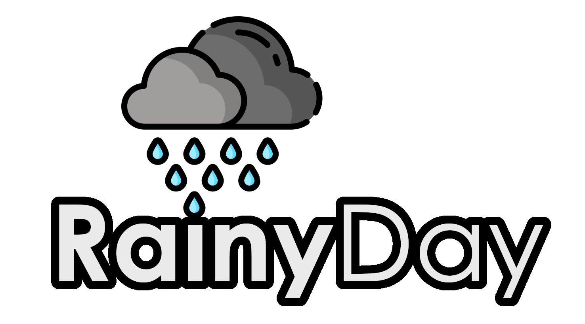
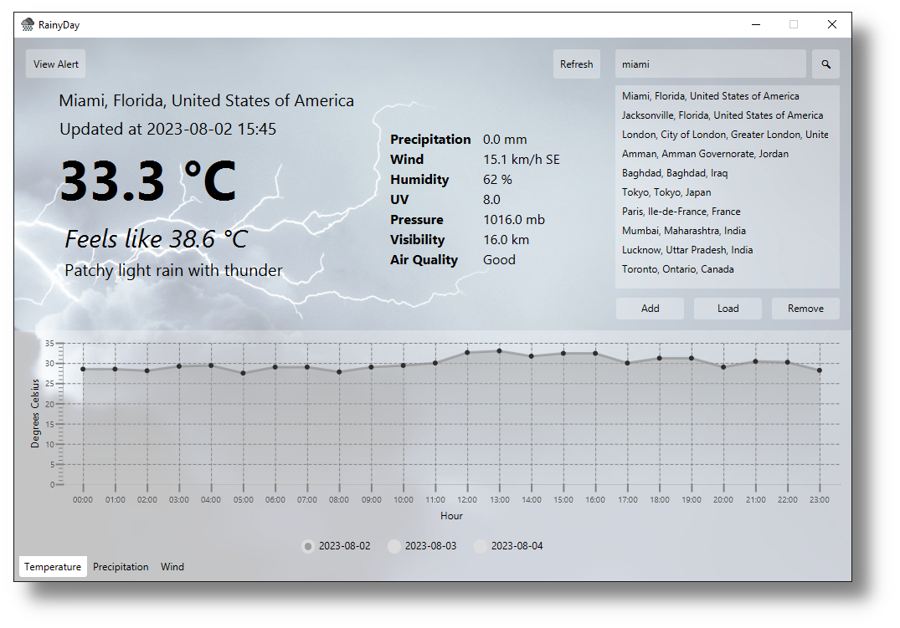
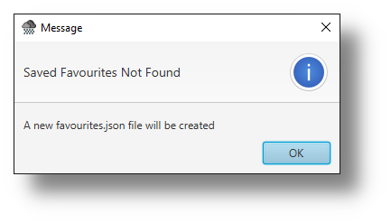
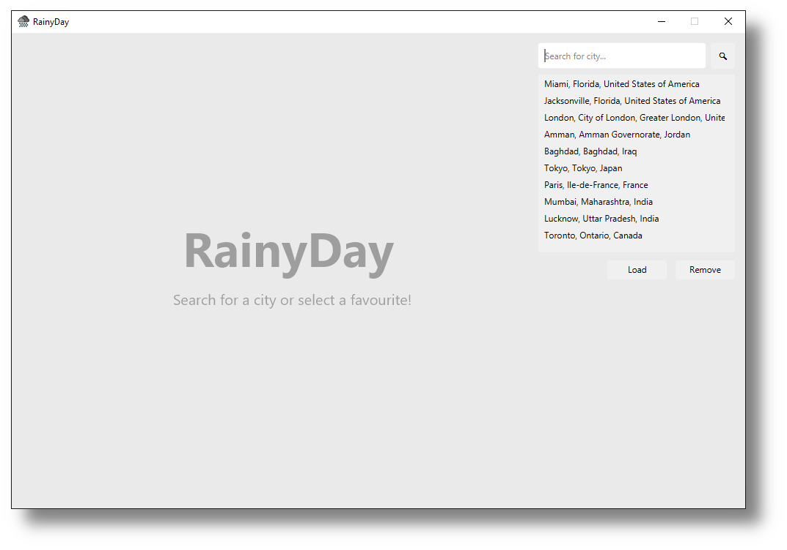
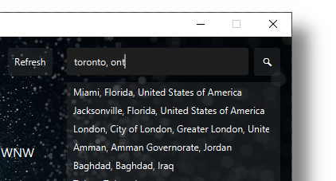
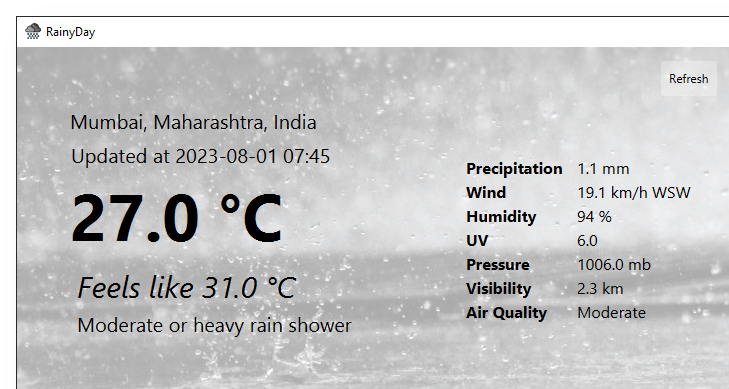
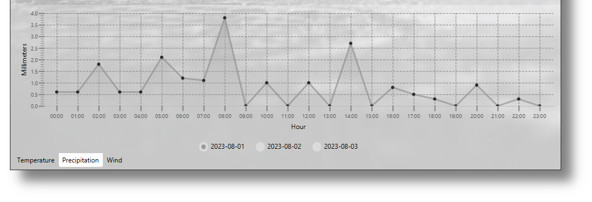
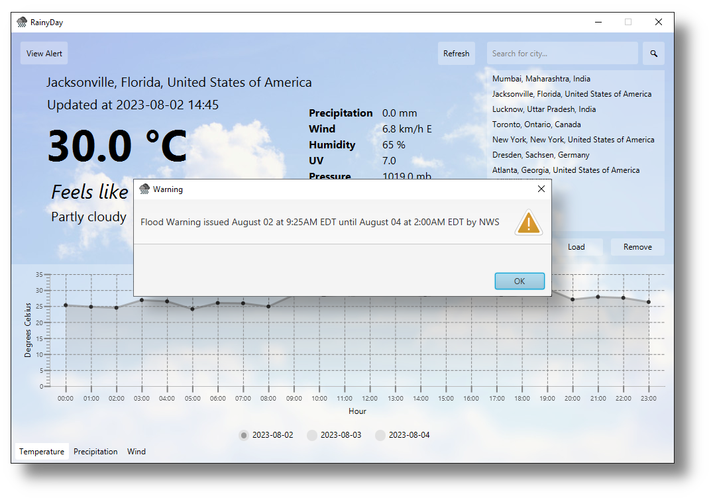

# RainyDay

The logo contains an icon from [www.flaticon.com](https://www.flaticon.com/).

<a href="https://www.flaticon.com/free-icons/rain" title="rain icons">Rain icons created by Freepik - Flaticon</a>

<!-- TOC -->
* [RainyDay](#rainyday)
  * [Introduction](#introduction)
  * [Goals](#goals)
  * [External Packages](#external-packages)
  * [Code Files](#code-files)
  * [Initial Setup](#initial-setup)
  * [Features](#features)
    * [Weather Search](#weather-search)
    * [Current Weather Data](#current-weather-data)
    * [3-day Forecast](#3-day-forecast)
    * [Beautiful themes and User Interface](#beautiful-themes-and-user-interface)
    * [Touch Screen Compatability](#touch-screen-compatability)
    * [Weather Alerts](#weather-alerts)
    * [Error/Exception Handling](#errorexception-handling)
  * [Features to Implement in the Future](#features-to-implement-in-the-future)
<!-- TOC -->

## Introduction
RainyDay is a weather app written in pure Java and styled with CSS, utilizing the RESTful 
[WeatherAPI](https://www.weatherapi.com/) for data. It is fully featured, easy to use, and beautifully 
designed. In addition to a full application, RainyDay also has a 
console client and API counterpart ([RainyDayConsoleClientAPI](https://github.com/ridvikpal/RainyDayConsoleClientAPI)).
This is if you want a console version of RainyDay or a Java API to use in your own code. I have extensively detailed 
the backend API design for RainyDay in that GitHub repo, if you would like to study that.

## Goals
The goal of RainyDay was to create a great looking and functional weather application. I was inspired by the Apple's
iOS weather app and was learning Java, so I decided to create a weather app in Java! Also, I noticed there was a 
significant lack of weather apps in Java. This was a great learning opportunity for Java, JavaFX, Maven, CSS, and 
RESTful APIs!

## External Packages
RainyDay utilizes the following external packages:

| Package                                                                                                | Used for                               |
|--------------------------------------------------------------------------------------------------------|----------------------------------------|
| `com.google.gson`                                                                                      | JSON serialization and deserialization |
| `javafx.scene`, `javafx.stage`, `javafx.util`, `javafx.animation`, `javafx.fxml`, `javafx.collections` | GUI creation                           |

## Code Files
The program java source code has been broken down into two packages:

1. `com.rainyday.rainyday`, which is code specific to (this) complete GUI application 
2. `org.rainyday` which is code specific to the RainyDay backend API, which is released separately under 
[RainyDayConsoleClientAPI](https://github.com/ridvikpal/RainyDayConsoleClientAPI).

These files are:

| File                       | Description                                                                                       | Package                 |
|----------------------------|---------------------------------------------------------------------------------------------------|-------------------------|
| `Controller.java`          | Contains JavaFX controller code                                                                   | `com.rainyday.rainyday` |
| `Main.java`                | Contains JavaFX application initialization code                                                   | `com.rainyday.rainyday` |
| `StartClass.java`          | Placeholder class to start the JavaFX application for packaging the entire app via Maven/Intellij | `com.rainyday.rainyday` |
| `Weather.java`             | Class that stores all weather information from the API                                            | `org.rainyday`          |
| `AutoCompleteElement.java` | Class that stores the location search information                                                 | `org.rainyday`          |
| `Location.java`            | Class that stores location information                                                            | `org.rainyday`          |
| `Current.java`             | Class that stores all current weather information                                                 | `org.rainyday`          |
| `Forecast.java`            | Class that stores all forecasted weather information                                              | `org.rainyday`          |
| `Astronomy.java`           | Class that stores all weather astronomy information                                               | `org.rainyday`          |
| `Alert.java`               | Class that stores all emergency weather alerts                                                    | `org.rainyday`          |
| `Astro.java`               | Class that stores the weather astronomy                                                           | `org.rainyday`          |
| `AlertSubClass.java`       | Subclass for Alert class                                                                          | `org.rainyday`          |
| `ForecastDay.java`         | Class that stores the forecast for a specific day                                                 | `org.rainyday`          |
| `Condition.java`           | Class that stores the current weather condition information                                       | `org.rainyday`          |
| `AirQuality.java`          | Class that stores the air quality information                                                     | `org.rainyday`          |
| `Hour.java`                | Class that stores the weather for particular hour in the forecast                                 | `org.rainyday`          |
| `Day.java`                 | Class that stores the weather for a particular day                                                | `org.rainyday`          |

In addition to these packages under the `java` directory, the CSS themes, images, and backgrounds can be found under
the `resources` directory.

## Initial Setup
Upon loading up RainyDay for the first time, the program will inform you that a `favourites.json` file does not exist 
and that a new favourites file will be created for you instead. This file simply contains saved favourite cities to 
quickly access weather information for. Just click "Ok" to dismiss this dialog and begin searching for cities to find
the weather of!

### Start Screen
The start screen does not show all the UI elements, just the search bar and favourites pane to not confuse the user.
Upon entering or selecting a valid favourite, all weather data and ui elements will be visible.

## Features
RainyDay was primarily inspired by the iOS weather app, so it has various similarities in design and features. In
general RainyDay has all the essential features a weather app would need!

### Weather Search
RainyDay allows you to search through almost any city in the world, and accepts any location parameter, including:
* City names
* Region/Province names
* Country names
* Latitude/longitude
* IP Addresses

A future modification will include adding autocomplete support for the searchbar. The RainyDay API already includes 
this functionality with the `getAutoCompleteTerm()` method, but it is yet to be implemented in the full GUI application. 

### Current Weather Data
Upon entering a valid location to retrieve weather for, RainyDay will retrieve the following current weather
information:

1. Temperature
2. Feels like temperature
3. Weather condition
4. Precipitation
5. Wind
6. Humidity
7. UV
8. Pressure
9. Visibility
10. Air Quality

For the user's reference it also provides the location and last updated time for the current weather information:

### 3-day Forecast
RainyDay provides the 3-day (the current day and 2 days ahead) forecast via the graph tabs on the bottom of the
application. The days can be toggled via the radio buttons on the bottom of the graph, and the type of graph via the
individual tabs.

"

### Beautiful themes and User Interface
Since RainyDay was inspired by iOS, it had to look good, and therefore I designed 15 individual CSS themes, 8 being
light (daytime) themes and 7 dark (nighttime) themes. Each of these themes include edited backgrounds originally from
[Unsplash](https://unsplash.com/). The themes automatically switch depending on the weather condition (for example,
thunderstorm theme for when a thunderstorm is happening) and between light and dark depending on whether it is daytime
or nighttime for the location being viewed.

### Touch Screen Compatability
RainyDay is fully compatible with touchscreen devices, since it utlizes JavaFX for the user interface, which natively
support touch screen events via callback functions such as `onAction()`. All buttons, tabs and search bars are 
compatible with touch screen events, as tested on a touch screen laptop. RainyDay has not been tested on mobile devices,
but due to native touch screen event compatibility it should be easy to port.

### Weather Alerts
An important feature of a weather app is the ability to see weather alerts, such as flooding or hurricane alerts.
RainyDay supports this with the "View Alerts" Button:

### Error/Exception Handling
RainyDay includes exception handling and checks for the following errors:

| Type        | Description                                                      |
|-------------|------------------------------------------------------------------|
| Information | No valid `favourites.json` file found                            |
| Error       | No valid city name entered in search bar (not found in database) |
| Error       | Error connecting to WeatherAPI (connection timeout)              |
| Error       | Error exporting favourites list to `favourites.json` file        |
| Error       | Error setting the correct daytime (light) theme                  |
| Error       | Error setting the correct nighttime (dark) theme                 |

Each time one of these errors occurs, the user is notified via dialog boxes.

## Features to Implement in the Future
There are still a few features I would like to implement in the future to take full advantage of the RainyDay Java API 
I created, which include:
* Location search autocomplete 
* Sunrise and sunset information
* Mobile support